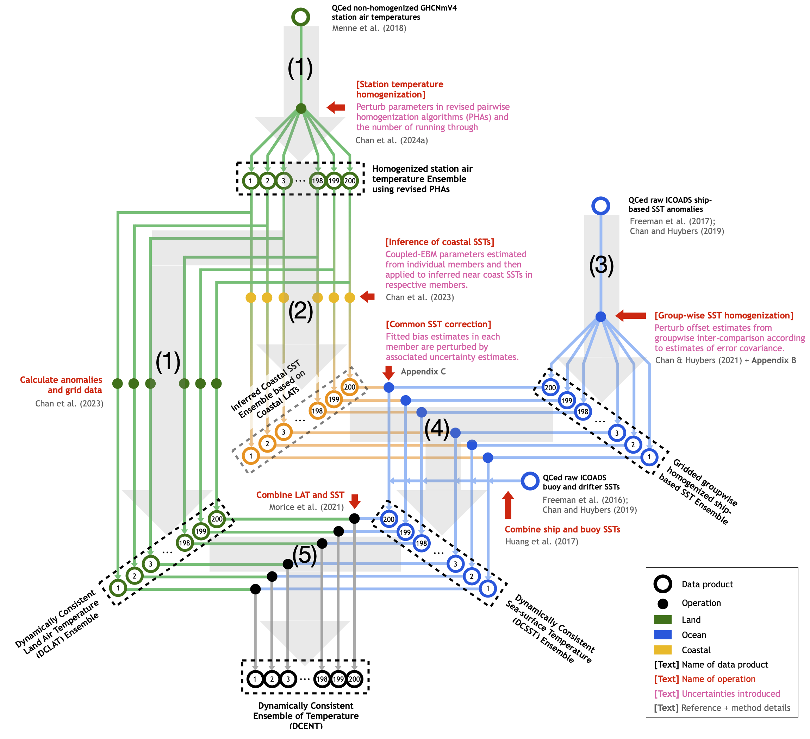

Code for reproducing Dynamically Consistent ENsemble of Temperatures (__DCENT__) from scratch ([Chan et al., 2024a](Chan_et_al_2024_maintext.pdf)).  The DCENT data set is available at [https://doi.org/10.7910/DVN/NU4UGW](https://doi.org/10.7910/DVN/NU4UGW).

---
### Table of Contents
* [Overview of DCENT](#overview-of-dcent)  
* [Code and Data Structure](#code-and-data-structure)
* [Installation Guide](#installation-guide)
* [Reproducing DCENT](#reproducing-dcent)
* [System Parameters](#system-parameters)

---
[<span style="color:gray">Back to Table of Contents</span>](#table-of-contents)
### Overview of DCENT

The Dynamically Consistent Ensemble of Temperatures (DCENT) is an ensemble of historical earth surface temperature estimates featuring sophisticated bias adjustments and comprehensive uncertainty quantification. It provides a cleaner picture for quantifying historical climate change at both global and regional scales, and for understanding climate variability and the dynamics behind it.

The development of DCENT builds upon a series of published papers and can be summarized into five steps, as indicated in the schematic below:

- (1) Homogenizing land station temperatures ([Chan et al., 2024b](https://doi.org/10.1175/JCLI-D-23-0338.1));
- (2) Inferring near coast SSTs from homogenized coastal station temperatures ([Chan et al., 2023](https://doi.org/10.1175/JCLI-D-22-0569.1));
- (3) Groupwise SST comparisons (Chan and Huybers, [2019](https://doi.org/10.1175/JCLI-D-18-0562.1); [2021](https://doi.org/10.1175/JCLI-D-20-0907.1));
- (4) Correcting groupwise homogenized SSTs using inferred near-coast SSTs ([Chan et al., 2024a](Chan_et_al_2024_maintext.pdf));
- (5) Combining the land and ocean components.



---
[<span style="color:gray">Back to Table of Contents</span>](#table-of-contents)
### Code and Data Structure

All scripts for generating DCENT have been organized in this stand-alone repository, with the following structure:

- 📁 root_directory/ - The main folder for all resources
  - 📁 [DCENT_code](https://github.com/duochanatharvard/1.5C_Warming)/ - Directory of this repository
    - 📁 [SATH_V3](SATH_V3)/ - Pairwise land station temperature homogenization
    - 📁 [ICOADS3_preprocess_NC](ICOADS3_preprocess_NC)/ - Preprocessing for ICOADS3 in NetCDF format
    - 📁 [SST_Intercomparison](SST_Intercomparison)/ - Sea Surface Temperature comparisons
    - 📁 [Air_Ocean_Intercomparison](Air_Ocean_Intercomparison)/ - Compares air and ocean data
    - 📁 [others](others)/ - Download and processing other estimates
    - 📁 [m_map](m_map)/ - Dependent functions
    - 📁 [CD_Computation](CD_Computation)/ - Dependent functions
    - 📁 [CD_Figures](CD_Figures)/ - Dependent functions
  - 📁 [Data](https://www.dropbox.com/scl/fo/aj4w03nclfeh8vp67svhi/ACgElhqlPoYOdy1v0EJpACk?rlkey=hhf2ecqhbrj0jojefmqh4dtwc&dl=0)/ - Main data storage directory
    - 📁 DCENT/ - The DCENT ensemble
    - 📁 DCLAT/ - Land station temperatures
    - 📁 GWSST/ - Groupwise homogenized SSTs
    - 📁 ICOADS/ - International Comprehensive Ocean-Atmosphere Data Set
    - 📁 others/ - Other existing estimates
    - 📁 log/ - Output logs of computation

Note that all data, including raw, intermediate, and final outputs, are provided [__here__](https://www.dropbox.com/scl/fo/aj4w03nclfeh8vp67svhi/ACgElhqlPoYOdy1v0EJpACk?rlkey=hhf2ecqhbrj0jojefmqh4dtwc&dl=0).
      
---
[<span style="color:gray">Back to Table of Contents</span>](#table-of-contents)
### Installation Guide

1. Git clone this repository.
2. Change directories in ``dir_list.txt`` for individual sub data folders.
3. Change information in ``DCENT_config.sh`` according to your systems.  A list of parameters and their meanings can be found [here](#system-parameters).

---
[<span style="color:gray">Back to Table of Contents</span>](#table-of-contents)
### Reproducing DCENT
We recommend reproducing the analysis in the following order.  Note that we provide scripts for submitting jobs as .sh files.  Although we tried to use namelists to avoid modifying these scripts, certain modifications may be required to match up with specific SLURM versions.  

__When submitting jobs, ensure that you are in the correct sub-folder of code.__

---
[<span style="color:gray">Back to Table of Contents</span>](#table-of-contents)
#### A. Downloading and preprocessing ICOADS3.0
This step is in [ICOADS3_preprocess_NC](ICOADS3_preprocess_NC) and has four substeps:
1. __[Downloading data]__  In the command line, use the following to download data:
```
nohup ./download_ds548.0_1800s.csh  &
nohup ./download_ds548.0_1900s.csh  &
nohup ./download_ds548.0_2000s.csh  &
```
2. __[Preprocessing data]__  This includes finding the nation and SST method information, as well as calculating the winsorized mean in each 5-day 1-degree regrid boxes for Sea-Surface Temperature (SST) and Marine Air Temperatures (MAT).  In the command line, use the following:
```
./submit_Step_01_02.sh
```
3. __[Calculating Neighbor Std]__ This step calculates the standard error required for conducting buddy checks.
```
./ICOADS_NC_Step_03_Neighbor_std
```
4. __[Performing Buddy Check]__ This step finalizes the quality control of ICOADS datasets.
```
./submit_Step_04.sh
```

---
[<span style="color:gray">Back to Table of Contents</span>](#table-of-contents)
#### B. Group-Wise Intercomparison of SSTs

This step is in [SST_Intercomparison](SST_Intercomparison).  This analysis has been wrapped into a Shell script:
```
./ICOADS_monthly_update.sh
```

---
[<span style="color:gray">Back to Table of Contents</span>](#table-of-contents)
#### C. Land Station Temperature Homogenization

This step is in [SATH_V3](SATH_V3), which has 3 substeps:
1. __[Downloading data]__  Update to get the most recent version of GHCNmV4:
```
operational.sh
```
2. __[Homogenization]__ Perform the pairwise homogenization:
```
./Run_SATH_multiple_CPUs.sh GHCN auto 50 100  # The first 100 members
./Run_SATH_multiple_CPUs.sh GHCN GAPL 50 1000  # The second 100 members
```
3. __[Post-processing]__  Grid station-based temperature and calculate anomalies relative to the 1982--2014 climatology: 
```
./submit_GHCN3R_post.sh GHCN auto 50
./submit_GHCN3R_post.sh GHCN GAPL 50
```

---
[<span style="color:gray">Back to Table of Contents</span>](#table-of-contents)
#### D. Air & Ocean Intercalibration

This step is in [Air_Ocean_Intercomparison](Air_Ocean_Intercomparison), which has 2 substeps:
1. __[Infer coastal SSTs]__ from coastal station-based temperatures:
```
./submit_AOI.sh
```
2. __[Generate DCENT]__ as the final product:
```
./submit_output_DCENT.sh
```
The output of this step is a 200-member DCENT ensemble, in the DCENT folder, which can be downloaded from [here](https://www.dropbox.com/scl/fo/zwf5rkuzv8dr4b2mpihyp/ACpStBcvy8aYQGdpK2BBjY4?rlkey=kp8ud47baxfjtulcm1iokk9jr&dl=0).


---
[<span style="color:gray">Back to Table of Contents</span>](#table-of-contents)
### System Parameters

- **`cluster_account`** (`soton`): Specifies the account name for accessing cluster resources.
- **`cluster_use`** (`batch`): Defines the cluster usage type, indicating batch processing tasks.
- **`cluster_bigmem`** (`highmem`): Specifies the memory type required, indicating the need for high-memory nodes.

- **`cluster_time`** (`3599` minutes): Sets the maximum duration for regular jobs on the cluster, allowing each job to run for just under one hour.
- **`cluster_long_time`** (`7199` minutes): Specifies the duration for longer jobs, permitting up to approximately two hours.

- **`ICOADS_preprocess_mem`** (`50000` MB): Memory required for preprocessing ICOADS data.
- **`LME_bin_mem`** (`80000` MB): Memory required for binning groupwise SST pairs.
- **`download_mem`** (`80000` MB): Memory required for download operations.
- **`LME_mem`** (`1300000` MB): Memory required for running SST groupwise intercomparison.
- **`SATH_net_mem`** (`10000` MB): Memory required for identifying neighboring network in the station temperature pairwise homogenization.
- **`SATH_ibp_mem`** (`8000` MB): Memory required for identifying breakpoints in the station temperature pairwise homogenization.
- **`SATH_att_mem`** (`20000` MB): Memory required for attributing breakpoints in the station temperature pairwise homogenization.
- **`SATH_comb_mem`** (`20000` MB): Memory reserved for combining breakpoints nearby in time in the station temperature pairwise homogenization.
- **`SATH_est_mem`** (`80000` MB): Memory required for estimating adjustments in the station temperature pairwise homogenization.
- **`SATH_2nd_mem`** (`25000` MB): Memory required for higher-order iterations in the station temperature pairwise homogenization.
- **`SATH_grid`** (`30000` MB): Memory required for gridding homogenized land station temperatures

---
Maintained by __Duo Chan__ (Duo.Chan@soton.ac.uk)

Last Update: July 4, 2024